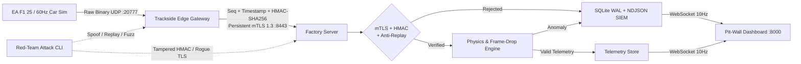

## Architecture

```mermaid
flowchart LR
    Car["EA F1 25 / 60Hz Car Sim"] -->|"Raw Binary UDP :20777"| Edge["Trackside Edge Gateway"]
    Attacker["Red-Team Attack CLI"] -.->|"Spoof / Replay / Fuzz"| Edge
    Edge -->|"Seq + Timestamp + HMAC-SHA256<br/>Persistent mTLS 1.3 :8443"| Factory["Factory Server"]
    Attacker -.->|"Tampered HMAC / Rogue TLS"| Factory
    Factory --> Verify{"mTLS + HMAC<br/>+ Anti-Replay"}
    Verify -->|"Rejected"| SIEM["SQLite WAL + NDJSON SIEM"]
    Verify -->|"Verified"| Physics["Physics & Frame-Drop Engine"]
    Physics -->|"Anomaly"| SIEM
    Physics -->|"Valid Telemetry"| Store["Telemetry Store"]
    Store -->|"WebSocket 10Hz"| Dash["Pit-Wall Dashboard :8000"]
    SIEM -->|"WebSocket 10Hz"| Dash
```